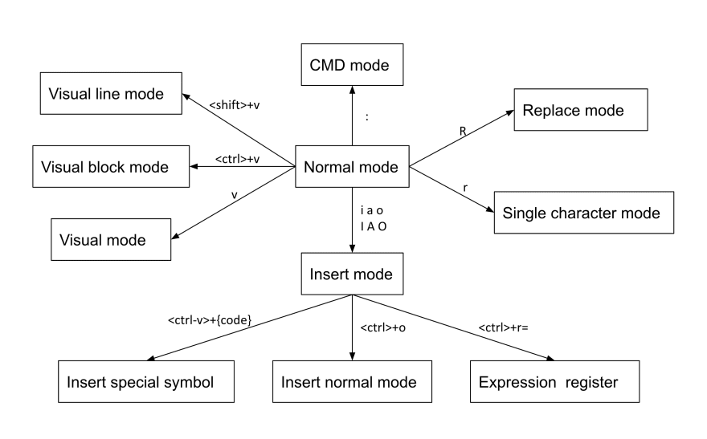
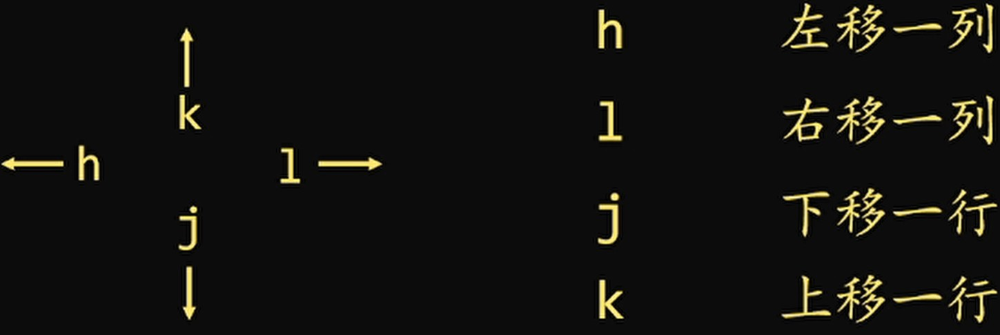

# Vim

!!! Abstract 

    虽不是目前最常用的工具，但是每次要用的时候都会有些生疏的工具。 🤦‍♂️
    
    常见操作还是要重点掌握，并且熟练

Vim命令太过多，先放上[Vim Cheat Sheet](https://vim.rtorr.com/)

都已经有[VSCode](https://code.visualstudio.com/)这种强大的工具,见[Stack Overflow survey 2023](https://survey.stackoverflow.co/2023/#most-popular-technologies-tools-tech:~:text=86%2C544%20responses-,Visual%20Studio%20Code,-73.71%25), Why [Vim](https://www.vim.org/) ? 

-  **"选什么选，我全都要!"**，不如在VSCode里面试试[这个插件](https://marketplace.visualstudio.com/items?itemName=vscodevim.vim)
- Vim 在Shell中无可代替，如果你用SSH远程想进行编辑工作，Vim不二之选
- **它可以让你脱离鼠标，只用键盘就高效完成一系列操作** 😎
- Vim(^^最流行的基于命令行的编辑器^^) + VScode(^^最流行的编辑器^^) 才是[YYDS](https://en.wiktionary.org/wiki/yyds#:~:text=Pinyin%20initial%20of%20%E6%B0%B8%E9%81%A0%E7%9A%84%E7%A5%9E%20(literally%20%E2%80%9Calways%20(being)%20the%20best%E2%80%9D).)！！！
    * PS: Vim 学习之路比较陡峭

Vim 起源于[Vi编辑器](https://en.wikipedia.org/wiki/Vi_(text_editor))(1976), Vim之父——[Bram Moolenaar](https://en.wikipedia.org/wiki/Bram_Moolenaar) .RIP.
## Vim哲学

因为在编程时，大多数时间是在阅读和编辑，而非在写。故Vim **有多种操作模式**

***一定要分清当前是处于什么模式下!***

- 普通模式(Normal mode): 默认的模式，无法输入字符，仅围绕文件移动并进行编辑
- 插入模式(Insert): 普通模式下摁`i`则进入了插入模式(Insert), 摁`esc`则返回普通模式
- 替换(Replace):用于替换文本
- 可视化(Visual): 用于选择文本块
- 命令行(Command-line): 用于执行命令

!!! quote "The end result is an editor that can match the speed at which you think."

## Vim基础

### 插入
> 在 Insert 和 Normal 模式下切换！

- 按`i`可在闪烁光标的 **前面** 插入
    * `10ihello [ESC]` → 会写下 hello hello hello hello hello hello hello hello hello hello 
- 按`a`可在闪烁光标的 **后面** 插入
- 按`I`可在 **当前行的第一个字符前面** 插入
- 按`A`可在 **当前行最后面** 插入
- 按`o`可在 **当前行的下一行** 插入
- 按`O`可在 **当前行的上一行** 插入

### 移动光标
均要在普通模式下进行输入

hjkl (对应←↓↑→)  , 也可以在前面加上数字 4e.g. `4j` 向下移动4行
    
PS: **不推荐用箭头，而是熟练用hjkl**（开始会很难用，很不习惯，克服！！）

- `0` 移动到当前行的 **行头**
- `$` 移动到当前行的 **行尾**
- `^` 移动到本行非blank字符的位置（所谓blank字符就是空格，tab，换行，回车等）
- `g_` 移动到本行最后一个不是blank字符的位置。
- `NG 或 Ngg 或 :N` 其中N为数字，则跳转到第N行
- `gg` 跳转到第一行
- `G`  跳转到最后一行
- 按照 **单词** 进行移动
    * `w` 到下一个单词的 **开头**(jump forwards to the start of a word) 
    * `W` 到下一个单词的开头(可包含标点符号)
    * `e` 到下一个单词的 **结尾**(jump forwards to the end of a word)
    * `E` 移动到空白处之前的单词末尾
    * `b` 到上一个单词的 **开头**(jump backwards to the start of a word)
    * `B` 到上一个单词的开头(可包括标点符号)

- `%` 匹配括号`(),{},[]`移动, PS: 需要先把光标先移到括号上
- `*` 和 `#`  匹配光标当前所在的单词，（*是下一个，#是上一个）

### 删除&复制&粘贴&撤销
- `x`  删除当前光标所在的一个字符
- `dd` 删除当前行，并把删除的行存到剪贴板里
    * `d$`: 删除从光标处到行尾的文本(常用于注释)
- `cw内容` 用 **内容** 替换从光标所在位置后到一个单词结尾的字符
- `yy` 拷贝当前行； 同样的也可以前面加数字， e.g. `3yy` 从光标处复制3行
- `p`  粘贴剪贴板的内容
- `u`  撤销
- `Ctrl + r` 取消撤销

### 打开/保存/退出/改变文件
- `:e <path/to/file>` 打开一个文件
- `:wq` → 存盘 + 退出 (:w 存盘, :q 退出)
- `:q!` → 退出不保存 
- `:qa!` 强行退出所有的正在编辑的文件，就算别的文件有更改
- `:bn` 和 `:bp` → 你可以同时打开很多文件，使用这两个命令来切换下一个或上一个文件

### 查找和替换
普通模式下 `/pattern` 查找搜索 pattern 的字符串

- 若多个匹配项，按`n`匹配到下一个,按`N`找上一个字符串

部分替换：

- `:s/[src]/[dst]`（只能在光标所在的行）, `/i`忽略大小写，`/g`全部匹配
    * 比如：将此行的hello替换为world --> `:s/hello/world/ig`
- 也可以制定范围，比如3~6行 --> `:3,6 s/hello/world/ig`

全部替换：`:%s/[src][dst]` , 默认不区分大小写

## Vim 进阶
### Visual模式（块操作）
按`v`可视化选择状态，左下角出现VISUAL，选中块后，可以对块进行d(删除)，y(复制)，x(剪切)

`shift + v` 可选择一行，进行操作

`ctrl + v` 可进行竖向选择, 比如批量注释代码:

- 按`ctrl+v` ,选中要注释的行 --> 输入`I` ，然后输入`//` --> 再输入`esc`

TO DO:

- [ ] 可视化补充
- [ ] VIM配置 AND SO ON....