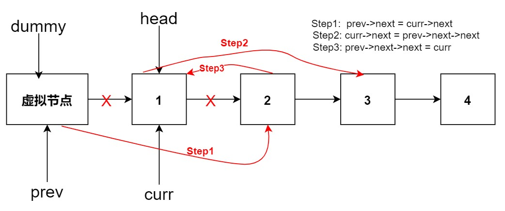
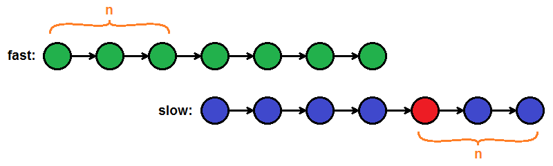
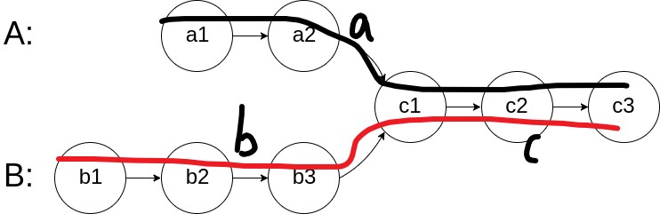

## [24. 两两交换链表中的节点](https://leetcode.cn/problems/swap-nodes-in-pairs/description/)

> 两两交换其中相邻的节点，并返回交换后链表的头节点

如图所示: 

```c++ linenums="1"
ListNode* swapPairs(ListNode* head) {
    if (!head || !head->next) return head;
    ListNode* dummy = new ListNode(0);
    dummy->next = head;
    ListNode* prev = dummy, * curr = head;
    while(curr && curr->next) {
        prev->next = curr->next; // step1
        curr->next = prev->next->next; // step2
        prev->next->next = curr; // step3

        prev = curr;
        curr = curr->next;
    }
    head = dummy->next;
    delete dummy;
    return head;
}
```

## [19.删除链表的倒数第N个节点](https://leetcode.cn/problems/remove-nth-node-from-end-of-list/)

双指针，fast先移动n步，然后fast和low同时走，fast到结尾，删除slow指向即可

```c++ linenums="1"
ListNode* removeNthFromEnd(ListNode* head, int n) {
    ListNode* fast = head, *slow = head;
    for (int i = 0; i < n; i ++) fast = fast->next;
    if(!fast) return head->next;
    while(fast->next) fast = fast->next, slow = slow->next;
    slow->next = slow->next->next;
    return head; 
}
```
## [160.链表相交](https://leetcode.cn/problems/intersection-of-two-linked-lists/description/)

**很巧妙的方法，一个从A走，一个从B走，谁先走到空，再绕到另一个开头走**

- 定会相交的起始节点碰面（即$a + c + b = b + c + a$）



```c++ linenums="1"
ListNode *getIntersectionNode(ListNode *headA, ListNode *headB) {
    ListNode*p = headA, *q = headB;
    while(p != q) {
        p = p ? p->next : headB; 
        q = q ? q->next : headA;
    }
    return p;
}
```

## [142.环形链表II](https://leetcode.cn/problems/linked-list-cycle-ii/)

- [ ] to do

