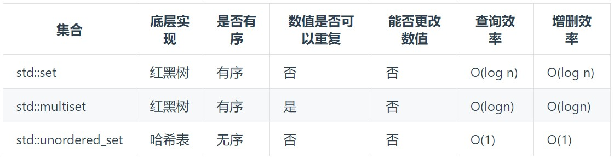
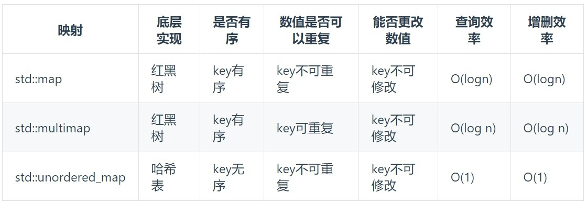

## 介绍

> HashTable: 用来快速判断一个元素是否出现在集合中

用哈希法，一般选择三种数据结构: 

- 数组：长度受到限制，若元素少而哈希值大则造成内存空间泄露
- set(集合)：里面放的只能是一个key
- map(映射)：`<key, value>`的存储结构

在C++中，set 和 map 分别提供三种数据结构: 


总：**当要使用集合来解决哈希问题的时候，优先使用`unordered_set`**，因为它的查询和增删效率是最优的，如果需要集合是 **有序** 的，那么就用`set`，如果要求不仅 **有序还要有重复数据** 的话，那么就用`multiset`

## [1.两数之和](https://leetcode.cn/problems/two-sum/description/)

1. 暴力 --> 时间复杂度$O(n^2)$
```c++ linenums="1"
vector<int> twoSum(vector<int>& nums, int target) {
    for (int i = 0; i < nums.size(); i ++) {
        for(int j = i + 1; j < nums.size(); j ++) {
            if (nums[i] + nums[j] == target) return {i, j};
        }
    }
    return {};
}
```
2. 哈希 --> 不需要key有序，用`std::unordered_map`
       - 结构为{key:数据元素,value:数组元素对应的下标}
```c++ linenums="1"
vector<int> twoSum(vector<int>& nums, int target) {
    std::unordered_map<int,int> hashtable;
    for (int i = 0;i < nums.size();i ++) {
        auto item = hashtable.find(target - nums[i]);
        if (item != hashtable.end()) return {item->second, i};
        hashtable[nums[i]] = i;
        // 或 hashtable.insert(pair<int, int>(nums[i], i));
    }
    return {};
}
```

## [202.快乐数](https://leetcode.cn/problems/happy-number/description/)

## [349.两个数组的交集](https://leetcode.cn/problems/intersection-of-two-arrays/description/)

## [242.有效的字母异位词](https://leetcode.cn/problems/valid-anagram/description/)