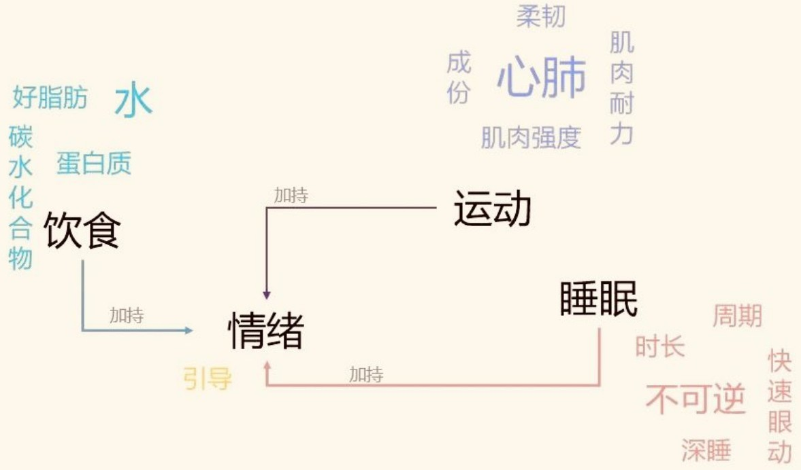

# 一月总结

&nbsp; &nbsp; &nbsp; &nbsp; 时间转眼间来的2月1号,如此之快，24年的1月就已经过去了，同样意味着研一上学期彻底结束了，算一算从18号晚上来到家也已经两周左右，正好抽时间回顾一下，也算是新年目标的其中一个环节——每月总结反思

- [x] 1.13终于完成了图书馆志愿者120h（12.10~1.13）
- [x] 1.14全部考试考完，15上午导师终于开了第一次的会（老师在讲台讲了两个多小时
- [x] [RedmiWatch](https://item.jd.com/100077926270.html)记录运动(健走+跑步)30次,累计15h （ ~~多亏了天津之旅~~ 🤣
- [x] 和舍友们完成了一次天津旅行1.15~1.18（不得不说作为宅男，真不怎么出去 🙈 
- [x] 玩了麻将（其实也算第一次，印象中很小的时候接触过，不过也不会） PS: **拒绝赌博**
- [ ] 在校上午听了几天听力，回来之后就搁置了（可能这月也就听了10天左右
- [x] 看完了why we sleep，了解了个大概，简单做了笔记（PS: 人体真真真复杂!!!
- [x] 本来要追[Game of Thrones](https://zh.wikipedia.org/wiki/%E6%9D%83%E5%8A%9B%E7%9A%84%E6%B8%B8%E6%88%8F_(%E7%94%B5%E8%A7%86%E5%89%A7))，看了一部多，结果把[解说](https://www.bilibili.com/video/BV1HM411G7Fj/?spm_id_from=333.337.search-card.all.click)看完了
- [ ] 并没有养成睡前和醒来的好习惯，甚至床上玩手机是常态（好难克服....
- [x] B站抽奖中了[Carl算法训练营](https://t.bilibili.com/890027265127088149?spm_id_from=333.999.0.0#:~:text=%E6%81%AD%E5%96%9C%E8%BF%99%E4%B8%A4%E4%BD%8D%E5%BD%95%E5%8F%8B%E4%B8%AD%E5%A5%96%EF%BC%8CB%E7%AB%99%E7%A7%81%E4%BF%A1%E6%88%91%E6%8B%89%E4%BD%A0%E5%85%A5%E7%BE%A4%E5%93%88%20%40H%2DYiheng%20%40%E8%9C%82%E8%9C%9C%E5%8A%A0%E7%89%9B%E5%A5%B6%E5%90%97)和[bilibili小挎包](https://www.bilibili.com/opus/888743336195653656?spm_id_from=333.999.0.0) （幸运哈哈哈~~~
- [x] 出了上学期的成绩，顺利通过（研究生怎么可能会有挂科的!!! 

------

## 天津之旅

&nbsp; &nbsp; &nbsp; &nbsp; 仔细想一想，貌似还真是 ^^第一次出去旅游^^，印象中小时候并没去过，大学就爬了爬泰山，毕竟学校就在那，接着就赶上了疫情，加上自己本身就挺宅，更不可能出去了。这次旅行总结简要来说: 就是吃喝玩乐（好像旅游就是如此），四个人住在御景嘉园，环境还是挺好的

- 吃喝:  [罾蹦鲤鱼](https://baike.baidu.com/item/%E7%BD%BE%E8%B9%A6%E9%B2%A4%E9%B1%BC/7794710)、[八珍豆腐](https://baike.baidu.com/item/%E5%85%AB%E7%8F%8D%E8%B1%86%E8%85%90?fromModule=lemma_search-box)(不得不说豆腐真的嫩，非常好吃)，~~天津狗不理和天津麻花（真贵）~~，新疆烤串(舍友推荐的店:同来顺烧烤餐厅，人可真多)等等等....
- 玩乐：津湾广场、世纪钟广场、滨江道，瓷房子、意大利风景旅游区、大光明桥、解放桥、五大道、民园广场、天主教教堂(第一次去教堂里面很是庄重!)，~~但张学良故居，张爱玲旧居，天津之眼(世界唯一建在桥上的摩天轮)等都并没有去~~，还通过同学的朋友进天津大学逛了逛（如今高校都不能随便进，很烦），可惜没去南开大学瞅瞅(需要预约!)

&nbsp; &nbsp; &nbsp; &nbsp; 还在那边赶上了下雪，还真挺大的。三天的时间，其实上午并没法起太早，所以一般中午吃个饭，下午出去逛，真走了挺多，一直走着jio都酸了，晚上再玩会儿就回来四个人打麻将，时间过得还是非常快的。奥对了，天津有地铁，^^第一次坐地铁^^(🤣)，小城市人无疑了!!! 冬天还是非常冷的，人并没很多，在外面溜达也是冻不行，不过出去和朋友玩一玩还是非常开心的，最终人均消费$500$左右。对比保定，对比家乡菏泽，就房子来说确实挺不一样的，别有一番滋味

-------

## 第一次组会

&nbsp; &nbsp; &nbsp; &nbsp; 导师主要讲的是开题准备(**开题时间:学硕8月**), ==小论文 --> 大论文(盲审)==，小论文需要达到什么水平？参考师兄师姐的。硕士要求创新性: **证明自己的方法和手段和别人不同而且比别人好** --> ^^理论证明(数学上) + 实验证明(证明自己说的对)^^, 若方向不能做实验，就不要选，属于自己给自己挖坑。==选的题目一定要能做实验==，别人是指这方面的全世界的研究成果(佐证就是相关参考文献)，故 **参考文献水平要高**!!!，非常之关键。而毕业标准是要求3个创新点，每一个标准即 ^^做了什么工作(意义) + 论证创新性 + 怎么做的(方法) + 达到的效果(理论证明、实验证明、算力分析)^^，做了什么工作体现为"提出了、给出了、设计了、编程实现了..."

&nbsp; &nbsp; &nbsp; &nbsp; **如何找创新点**？ 如果你能找到三个创新点，然后概括就是你的需要的题目。即先想创新点，再想题目，题目涵盖三个内容，e.g. ^^基于可信计算的用电信息采集终端完整性检测方法研究^^(师兄的小论文)；**新方法、新问题、老问题、老问题** 四个里面至少包含一个“新”，新时代下新能源新问题，要能善于发现问题，如何发现? **看得文献多&思考得多**，==选择期刊: 高水平，高代表性!==

!!! Note
    1. 针对此问题，目前的解决方法有...，这些存在的不足各是...，有一种方法解决这类问题上有优势，但没有人用在这个问题上，如果直接用哪里不合适，改进!——**新方法、老问题**

    2. 电网中要解决什么问题，通常用什么方法，再低碳环保、新能源建设要求中，对这个问题提出了更多的要求，所以要研究解决这个问题及其用的方法——**新问题**

> **电力期刊找问题，计算机期刊找方法**，计算机方法解决电力问题！

最好是电力问题(电力的特殊性)，用新技术解决电力问题，你比电力有优势！

- 有了好文章，你有更有底气面对各种事情

信息安全 --> **关于隐私保护** （师兄师姐主要研究方向），又称为匿名身份认证，常用方法:环签名、盲签名、零知识证明、中国剩余定理等...，**检索关键字："电力交易"**

**关于需求响应**，即电力需求响应，指当电力批发市场价格升高或系统可靠性受威胁时，**电力用户** 接收到供电方发出的诱导性减少负荷的直接补偿通知活电力价格上升信号后，改变其固有的习惯用电模式，达到减少或者推移某时段的用电负荷而响应电力供应，从而保障电网稳定，并抑制电价上升后的 **短期行为**，它是需求供给侧管理的解决方案之一

!!! Warning "导师箴言"
    **做论文要求的态度——认真、踏实做事**，学习其实是件辛苦的事情

-----

可以说1月一半都是在家度过的，2月也基本都在家里面，更要有目标的向前：

- [ ] 锻炼一周至少四到五次（碰巧有学校的[运动打卡活动](https://mp.weixin.qq.com/s/vTPeyWZU3d45uLxy6YGxKA)）
- [ ] 上午抽时间听听听力( ==英语和健身最终就是靠坚持==，而且都收益巨大!)
- [ ] 睡前和醒来的好习惯培养培养
- [ ] 中奖的算法课程[打卡](https://docs.qq.com/sheet/DUGRIUGliQ3dHQ25F?tab=BB08J2)
- [ ] 安全方向相关的知识尽量多看看 -->  早看论文（说实话一点是不想看(￣^￣)ゞ
- [ ] 能和朋友多沟通聊聊

!!! success "Wishes"
    不论怎么样，要保持健康!

